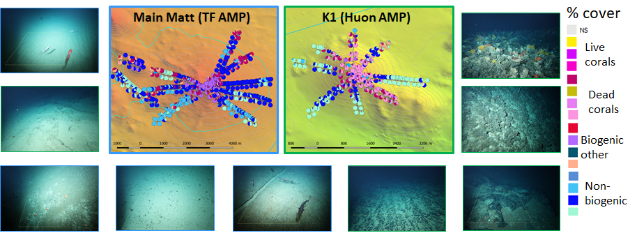

```{r setup, include=FALSE}
knitr::opts_chunk$set(
  results = 'asis',
  echo = TRUE,
  warning = FALSE,
  message = FALSE,
  fig.align = 'center'
)

#Load libraries
library(tidyverse)
library(gapminder)
library(kableExtra)
library(cowplot)

# read in the data I have tidied up in a separate R-project #(https://github.com/FranzisGIT/IN2018_V06_stills.git)

PCcoverbyImage <- read_csv("../../results/PCcoverbyImage.csv")
PC_cover <- read_csv("../../results/PCcover.csv")

VMEanno_DensQ <- read_csv("../../results/VMEanno_DensQ.csv")
VMEanno_PCcoral <- read_csv("../../results/VMEanno_PCcoral.csv")
VMEannoMatrix <- read_csv("../../results/VMEannoMatrix.csv")

```


# Introduction
I work in CSIRO Oceans and Atmosphere on deep-sea observational data from the outer continental shelf and the continental slope. 

# My Project
My current project is analysing still images of the seafloor on seamounts south of Tasmania, collected using a towed camera system. The images are annotated for (1) percent cover of substrate types, including non-biotic rocks, sediments etc and a matrix forming stony coral, distinguished into live and dead fractions; and (2) for density (number of individuals per m^2^) of taxa considered indicators for vulnerable marine ecosystems (VMEs).

## Preliminary results

In total 6100 images have been selected for annotation which is done in separate software and still ongoing. To date `r nrow(PCcoverbyImage)` images have been annotated for percent cover of substrate types in TransectMeasure software from [SEAGIS](https://www.seagis.com.au/), and `r nrow(VMEannoMatrix)` have been annotated for VME taxa in the CSIRO insidence of the MBARI developed Video Annotation and Registration System ([VARS](http://vars.it.csiro.au/)). 

Combinig the percent cover and density data into a by-image data matrix, which although not an officially tidy format is a useful output for taking the data into [QGIS](https://qgis.org/en/site/) for mapping visualisations.


```{r Combine_Anno, echo=T}

# creaing a summary of the total density of VME indicator taxa

VMEonly_TotDens <- VMEanno_DensQ %>% 
  filter( CONCEPT == "Black & Octocorals" |
                  CONCEPT == "Brisingid"  |
                  #CONCEPT == "D.horridus",
                  CONCEPT == "Enallopsammia"  |
                  #CONCEPT == "Hydrocorals"  |
                  CONCEPT == "Hydrocorals: Branching"  |
                  #CONCEPT == "Irregular urchins"  |
                  CONCEPT == "Madrepora"  |
                  #CONCEPT == "No-VMEfauna",
                  #CONCEPT == "Regular urchins"  |
                  CONCEPT == "S.variabilis"  |
                  CONCEPT == "Sponges"  |
                  CONCEPT == "Stalked crinoids"  |
                  CONCEPT == "Stony corals",
                  #CONCEPT == "True anemones: Fourlobed"  |
                  #CONCEPT == "Unstalked crinoids"
          )%>% 
  group_by(image_key, SVY_OPS, MapLoc, depth) %>% 
  summarise(VMEtaxaDens=sum(Dens))

#temporary table: add summary of total density of VME taxa to densities of separated counted taxa
  
 TVME <- VMEannoMatrix %>% 
  select(image_key,
         `Black & Octocorals`,
         `Brisingid`,
         `D.horridus`,
         `Enallopsammia`,
         `Hydrocorals`,
         `Hydrocorals: Branching`,
         `Irregular urchins`,
         `Madrepora`,
         `No-VMEfauna`,
         `Regular urchins`,
         `S.variabilis`,
         `Sponges`,
         `Stalked crinoids`,
         `Stony corals`,
         `True anemones: Fourlobed`,
         `Unstalked crinoids`,
         PC_Sub_CoralReef,
         PC_EnallopMatrix,
         PC_SolMatrix) %>% 
  left_join(VMEonly_TotDens, by=c("image_key"="image_key")) %>% 
  select(-MapLoc, -depth, -SVY_OPS)


# select out the Percent cover values from PC_Matrix and add this to the table above

VME_AnnoAll <- PCcoverbyImage %>% 
  select(image_key,
         'SC-ENLP',
         'SU-ENLP',
         'SC-SOL',
         'SU-SOL',
         'SC-MAD',
         'SU-MAD',
         'SU-BCOR',
         'SU-BBAR',
         'SU-BOTH',
         'SU-ROK',
         'SU-BOL',
         'SU-COB',
         'SU-CONBIO',
         'SU-PEBGRAV',
         'SU-SAMU',
         'NS') %>% 
  inner_join(TVME, by=c("image_key"="image_key"))
```

```{r myTable1, out.width='100%', echo = T}
#Reading out the first 5 lines of the data
kable(head(VME_AnnoAll, n=5), caption ="Combined data matrix (by image) of percent substrate types and VME taxon densities, including the summaries of densities") %>% 
  kable_styling("striped") %>% 
  scroll_box(width = "100%")

```

QGIS is my preferred tool for creating maps because it allows for interactive zooming.

{width=24cm}


The distribution of the live and dead coral matrix formed by Solenosmilia variabilis_ (coded as SC_SOL and SU_SOL) is of particular interest, because this coral is a structural engineer forming biogenic habitats that are particularly vulnerable to impacts by demersal trawling.  

```{r MyFig1,  out.width='100%', fig.align='center', fig.cap="Depth distribution of (A) all substrate types  and (B) individual depth distribution of the percent cover of live (SC_SOL) and dead (SU_SOL) coral matrix"}
#distribution of the substrate types
# create a vector with the sequence of the substrate types for ordering them in a meaningful way
SubstSeq <- c('SC-ENLP',
              'SU-ENLP',
              'SC-SOL',
              'SU-SOL',
              'SC-MAD',
              'SU-MAD',
              'SU-BCOR',
              'SU-BBAR',
              'SU-BOTH',
              'SU-ROK',
              'SU-BOL',
              'SU-COB',
              'SU-CONBIO',
              'SU-PEBGRAV',
              'SU-SAMU',
              'NS')
Plot1 <- ggplot(PC_cover,
       mapping= aes(x=factor(L2_Code, level =SubstSeq),              #call the pre existing vector
                    y=depth,
                    size=PC_cover)
  )+
  geom_point(alpha=0.1)+
  scale_y_reverse() +                            # reverse y-axis because it represents ocean depth 
  theme(axis.text.x = element_text(angle = 90))+   # rotate the label on x-axis
  labs(x="substrate type", y="depth")


Plot2 <- PC_cover %>% 
  filter(L2_Code == "SC-SOL" |
         L2_Code == "SU-SOL"  ) %>% 
  ggplot(aes(x = depth,
             y = PC_cover))+
  geom_point(alpha=0.2)+
  facet_wrap(~L2_Code)

plot_grid(Plot1, Plot2, ncol=1, labels = c('A', 'B'))

```

The depth distribution of the coral matrix is clearly limited to between ~800 and ~1600m depth, with the live corals limited to ~900 to 1300m (Figure \@ref(fig:MyFig1). The percent cover of live coral is mostly below 25% while dead coral regularly reaches 100% coverage (Figure \@ref(fig:MyFig1)).

The density data distribution of VME taxa shows the typical high frequency of low densities and a rapid decrease and long tail of higher densities of animals in the quadrats (Figure \@ref(fig:MyFig2)). 

```{r MyFig2, fig.align='center', fig.height= 4, fig.width=6,  fig.cap="Frequency distribution of total density of VME taxa only "}
# looking at the distribution of density and number of taxa over the whole data set note non-VME taxa are commented out

VMEonly_TotDens %>% 
  ggplot(aes(x = VMEtaxaDens))+
  geom_histogram()+
  labs(x="density of VME taxa (ind./m2)", y="count")


```
The importance of coral matrix as a substrate for various VME taxa is of particular importance, because the matrix is vulnerable to damage and removal by fishing using demersal trawls. Figure \@ref(fig:MyFig3) shows the relationship between the density of the measured VME taxa and the percent cover of coral matrix substrate.

```{r MyFig3, fig.align='center', fig.height= 4, fig.width=10,  fig.cap="Relationship between the density of idividual VME taxa and the percent cover of matrix forming coral"}

VMEanno_DensQ %>% 
  left_join(PCcoverbyImage, by=c("image_key"="image_key")) %>% 
  filter((`SC-SOL`+`SU-SOL`) != 0 &
        CONCEPT != "Hydrocorals" &
        CONCEPT != "True anemones: Fourlobed" &
        CONCEPT != "No-VMEfauna" ) %>% 
    ggplot(mapping = aes(x= (`SC-SOL`+`SU-SOL`), 
                     y= Dens
                     ))+
   geom_point()+
  labs(x="% cover coral matrix (dead and alive)", y="density of VME taxa (ind./m2)")+
  facet_wrap(~CONCEPT, scales = "free_y")

```

# My Digital Toolbox

My digital toolbox includes:

- SQL: DB-visualiser and ORACLE
- R: tidyverse, dplyr, ggplot, knitr
- Markdown
- QGIS

Through data school I have developed scripts using **R tidyverse** to automate reading, tidying up and quality checking the data extracts from **SQL** queries in the ORACLE database and from direct software outputs.

**MarkDown** with **knitr** is a useful tool for describing the data QC process and presenting data summaries, initial plots (**ggplot**) and analyses to collaborators.

Having automated processing into consistent data outputs facilitates data visualisations in **R** and **QGIS**, and summaries while annotations are still in progress.

# My time went

Much of my time was spent creating scripts for tidying up the data outputs from TransectMesure and VARS into a format that is amenable for analysis and plotting in R and input to QGIS.

# Next steps

In the near future I want to hone my skills in using R for data wrangling and tidying futher for use with my image data projects, and introduce some of these tools into the workflow for my team. 
I want to apply my new skills to understand and use R projects, BitBucket repositories and Markdown documents my colleagues have ceated under another project I am involved in. This will hopefully lead to my taking over some of the tasks previously done by my colleagues. 
Finally, I can see the potential in using R and Markdown for new work we have identified in my team: creating a series of descriptions of putative octocoral species, with linkages to photographs and CAAB records, all following the same outline and template. I am keen to explore creating these using a tempate in R, using Markdown.

Data School also introduced me to the usefulness of the CSIRO Research Data Planner - a tool that I intend to employ in current and furture projects.

# My Data School Experience

I liked the format of Data School, it allowed me to get past my initial hesitations about using R and the code based environment. As mentioned throughout this document, I can see many applications of my new found knowledge in my daily work.
